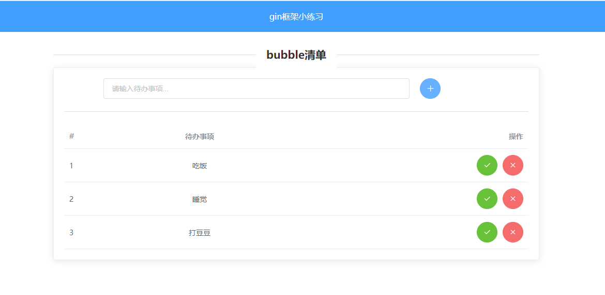

# memo
web备忘录
一个基于gin+gorm开发的练手小项目，通过该项目可初识go web开发该有的姿势。

实现了一个web上的备忘录清单，可以对清单列表进行CRUD操作


## 使用指南
### 下载
```bash
git clone git@github.com:ZhangMuran/memo.git
```
### 配置MySQL
1. 在你的数据库中执行以下命令，创建本项目所用的数据库：
```sql
CREATE DATABASE bubble DEFAULT CHARSET=utf8mb4;
```
2. 在`bubble/conf/config.ini`文件中按如下提示配置数据库连接信息。

```ini
port = 10000
release = false

[mysql]
user = 你的数据库用户名
password = 你的数据库密码
host = 你的数据库host地址
port = 你的数据库端口
db = bubble
```

### 执行

```bash
go run main.go
```

启动之后，使用浏览器打开`http://127.0.0.1:10000/`即可。
